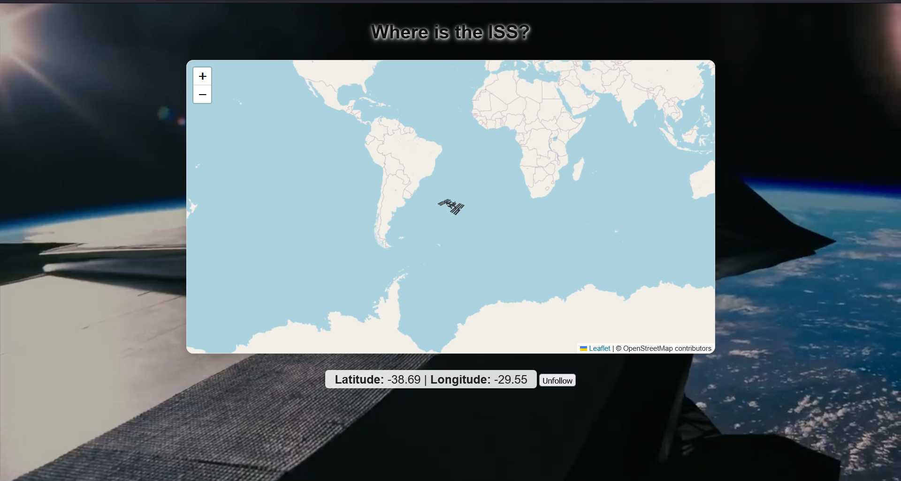

# ISS-Tracker

Track the International Space Station in real time on an interactive world map using the [Where the ISS at? API](https://wheretheiss.at/) and [Leaflet.js](https://leafletjs.com/). This project was created as a learning exercise for working with APIs, real-time data, and interactive maps.

## Features

- Real-time ISS position updates every second
- Interactive world map with a custom ISS icon
- "Follow ISS" button to toggle automatic map centering
- Displays current latitude and longitude of the ISS
- Background space video and looping audio for an immersive experience

## How it works

The app fetches the ISS's current position from the API and updates the map marker and coordinates on the page. If "Follow ISS" is enabled, the map automatically centers on the ISS as it moves.

### Example Code

```javascript
async function getISS() {
  try {
    const res = await fetch('https://api.wheretheiss.at/v1/satellites/25544');
    if (!res.ok) throw new Error('Network response was not ok');
    const data = await res.json();
    const { latitude, longitude } = data;

    document.getElementById('lat').textContent = latitude.toFixed(2);
    document.getElementById('lon').textContent = longitude.toFixed(2);

    marker.setLatLng([latitude, longitude]);

    if (followISS) {
      map.setView([latitude, longitude], map.getZoom());
    }
  } catch (error) {
    console.error('Failed to fetch ISS position:', error);
  }
}
```

**What this code does:**  
- Fetches the current ISS position from the API  
- Updates the latitude and longitude on the page  
- Moves the ISS marker on the map  
- If "Follow ISS" is enabled, keeps the map centered on the ISS

## Files

- `space.js` — Main JavaScript logic for fetching data and updating the map
- `space.html` — Main HTML file with map, video, and audio
- `space.json` — Example ISS data (for reference or offline use)
- `audio/space.mp3` — Background audio file
- `videos/space.mp4` — Background video file

## Getting Started

1. Clone the repository
2. Make sure you have an internet connection (for the API and map tiles)
3. Open `space.html` in your browser

---
Made for fun and learning! You can also contribute.

## Motive 
- To add a 3D mode if possible...:)

## Demo



## Contributing

Pull requests are welcome! For major changes, please open an issue first to discuss what you would like to change.
